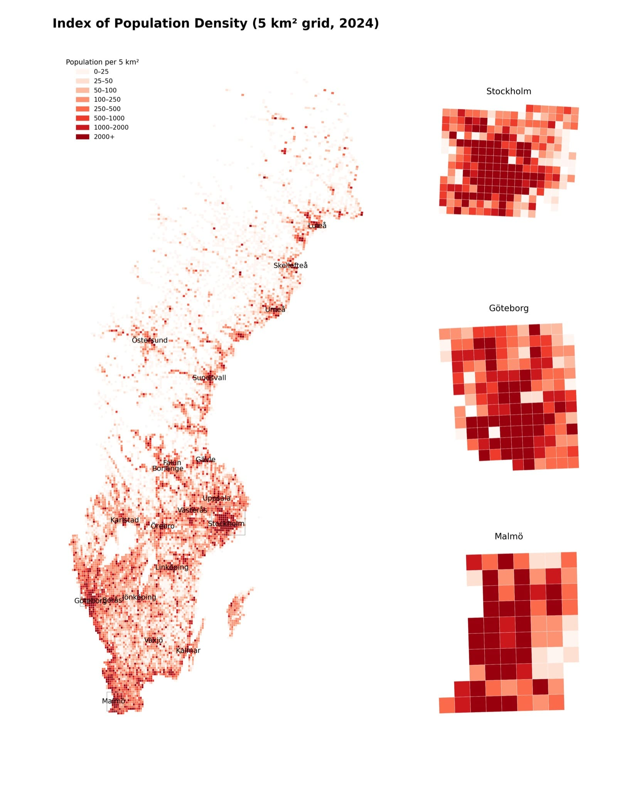
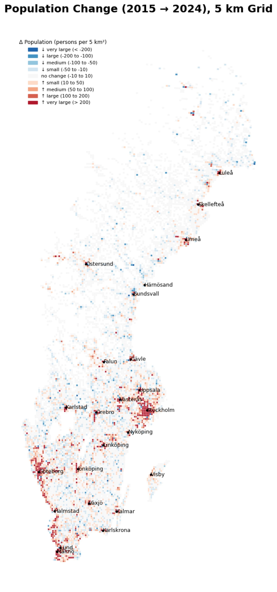
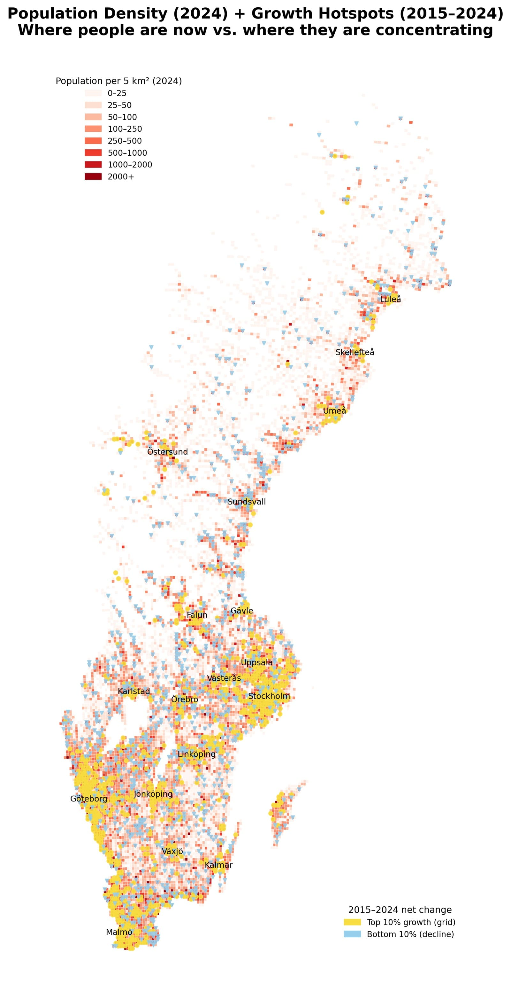
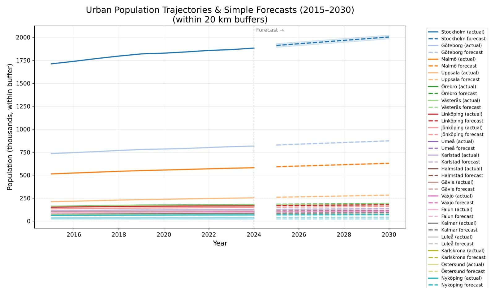
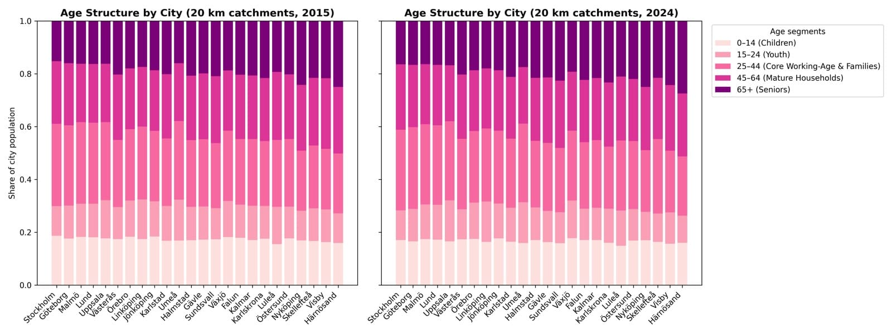

# Demographic Insights for Retail Market Entry in Sweden

## A Data-Driven Expansion Strategy for Retail

### Prepared by: Yanxiang Du  
### Date: 2025.11.16

---

# Agenda

## 1. Executive Summary  
## 2. Data & Methodology  
## 3. Market Opportunity Sizing: Retail Potential Based on Population Catchments
## 4. Population Segmentation & Regional Consumer Profiles
## 5. Market Implications & Entry Recommendations

---

---

# 1. Executive Summary

<ul class="gc-list">
  <li><strong>Growth is highly urban and corridor-based.</strong> 
  Population and retail potential are increasingly concentrated along the Stockholm–Uppsala, Göteborg, and Malmö–Lund corridors, while large parts of inland and northern Sweden face stagnation or decline.</li>

  <li><strong>5 km grid analysis reveals where demand is truly building.</strong> 
  Aggregating SCB’s 1 km data into 5 km grids highlights clear clusters of density, long-term growth, ageing hotspots, and young-family inflows that are not visible in traditional municipality-level statistics.</li>

  <li><strong>Young families and working-age adults drive the most attractive markets.</strong> 
  The 25–44 “core family” segment and 15–24 youth cluster around major metros and selected regional hubs, forming the strongest base for future grocery, convenience, and beauty/personal-care demand.</li>

  <li><strong>Tiered city clusters support a phased entry strategy.</strong> 
  Tier 1 metros (Stockholm, Göteborg, Malmö, Uppsala) combine scale, growth, and spending power; Tier 2 regional hubs (e.g. Växjö, Örebro, Jönköping, Umeå) show accelerating momentum; declining regions require cautious, efficiency-focused presence.</li>

  <li><strong>Format and capex should follow demographics, not just geography.</strong> 
  Large, full-assortment stores fit dense, fast-growing corridors; mid-size and compact formats suit stable mid-sized cities; ageing or shrinking regions are best served with lean, essentials- and health-focused networks.</li>
</ul>

---

# 2. Data & Methodology (1/2)

<ul class="gc-list">

  <li><strong>Data Source:</strong> SCB population statistics in 1 km² GeoParquet grids (2015–2024), including:
    <ul class="gc-list">
      <li>Total population</li>
      <li>Population by five-year age bands</li>
      <li>Population by gender (used to approximate age–sex splits)</li>
    </ul>
  </li>

   

  <li><strong>Spatial Levels Used:</strong>
    <ul class="gc-list">
      <li><strong>National view — 5 km grids</strong> 
        All population density and change maps are shown on a 5 km grid, aggregated from the underlying 1 km cells.  
        This enhances colour contrast and makes spatial trends easier to see, while all statistical calculations
        (e.g. growth rates, age structure, city buffers) are still based on the original 1 km data.
      </li>
    </ul>
  </li>

</ul>

---

# 2. Data & Methodology (2/2)

<ul class="gc-list">

  <li><strong>City view — 20 km buffers</strong>
    <ul class="gc-list">
      <li>
        Buffers are constructed by taking the coordinates of Sweden’s main cities as centres and extending
        20 km outward around the corresponding 1 km grid cells.  
        These buffers approximate functional urban catchment areas where people live, work and shop, and are used
        for city-level population, YoY growth and retail demand estimation.
      </li>
    </ul>
  </li>

   

  <li><strong>Age Segmentation:</strong>
    <ul class="gc-list">
      <li><strong>15–24 (“youth & early-stage consumers”)</strong> — indicator of talent inflows, university presence and future labour supply.</li>
      <li><strong>25–44 (“core working-age & family segment”)</strong> — strongest driver of household formation, retail spending and long-term market viability.</li>
      <li>Other groups (0–14, 45–64, 65+) included for overall structural understanding.</li>
      <li>Male/female shares within each age group are approximated using local 1 km grid gender ratios.</li>
    </ul>
  </li>

</ul>

---

# 3 Market Opportunity Sizing: Retail Potential Based on Population Catchments

---

## 3.1 Consumer Density & Retail Demand Potential (2024)

   <h6><em>This map illustrates Sweden’s population density in 2024, aggregated into 5 km grids to highlight major spatial concentration patterns.</em></h6>
<table>
<tr>
  <td></td>
    <td style="vertical-align: top; padding-left: 10px; width:%10%;">
   

     

<ul class="gc-list">
<h6>Sweden Retail Market Overview (2015–2024)</h6>
<ul>
  <li>The Swedish retail market grew from approximately <strong>921 billion SEK (2015)①</strong> to <strong>1.24 trillion SEK (2024)</strong>.</li>
  <li>Nationwide demand expanded by roughly <strong>35%</strong>, supported by both population growth and rising per-capita spending.</li>
  <li>Urban corridors—Stockholm–Uppsala, Göteborg, and Malmö—remain the dominant engines of retail demand.</li>
  
  
 

  <li> <em>① Retail demand is estimated as total population × per-capita retail spending. Per-capita values are based on SCB’s 2024 food & beverage spending (39,389 SEK, scaled ×3 for total retail), with the 2015 level assumed to be 80% of the 2024 figure</em>.</li>

</ul>

</ul>
  </td>
</tr>
</table>

---

##  3.2 Demand Growth Corridors & Declining Regions (2015–2024)

<table>
<tr>
  <td></td>
  <td style="vertical-align: top; padding-left: 10px; width:%10%;">
      <!-- <h6><em>This map shows the 2015–2024 population change by calculating 2024 minus 2015 values for each 1 km cell, aggregated into a 5 km grid.</em></h6> -->

  <td></td>
  <td style="vertical-align: top; padding-left: 10px; width:%10%;">

<!-- <ul> -->
<!-- <ul class="gc-list">

  <!-- <h6>· Darker red indicates stronger long-term population growth.</h6>
  <h6>· Bright red corridors highlight rapid expansion around Stockholm–Uppsala, Göteborg, and Malmö–Lund.</h6>
  <h6>· Suburban belts show the highest increases due to family migration.</h6>
  <h6>· Northern inland regions show stagnation or decline over the 10-year period.</h6> -->
<!-- </ul> --> 

<!-- <ul class="gc-list">
<h6>🔴 &nbsp; Growth Corridors</h6>
  <li>Stockholm shows the strongest net population increase (largest cumulative gain), followed by Göteborg, Malmö, and Uppsala.</li>
  <li>Their sustained growth indicates higher market potential and earlier entry suitability.</li>
 
</ul>

<h6>🔵 &nbsp; Declining Regions</h6>

<ul class="gc-list">
  <li>Härnösand, Karlskrona, Falun, Visby, and Luleå show steady negative or stagnant growth.
  </li>
  <li>These regions present higher entry risk and suit cautious or selective expansion.</li>
  
</ul> -->

  </td>
</tr>
</table>

---

<h6> Figure1 The 5 km grid map highlights where population gains (red) and losses (blue) occurred.
It reveals strong growth around major metros and clear decline across inland and rural regions.</h6>

<h6> Figure2 Shows which city clusters grew the most over the past decade.Fast-growing cities like Uppsala, Malmö, and Växjö indicate rising demand, while places like Härnösand show stagnation or decline.</h6>

<ul class="gc-list">
<h6>🔴 &nbsp; Growth Corridors — Commercial Potential</h6>

  <li><strong>Metro corridors offer the strongest commercial upside</strong> — Stockholm–Uppsala, Göteborg, and Malmö–Lund combine fast growth with high purchasing power.</li>

  <li><strong>Regional hubs</strong> like Växjö, Umeå, Jönköping, Kalmar, and Örebro show rising young-family demand and stable long-term potential.</li>

  <li><strong>Outer commuter belts</strong> are high-opportunity zones driven by new housing and rapid household formation.</li>

</ul>

<h6>🔵 &nbsp; Declining Regions — Commercial Challenges</h6>

<ul class="gc-list">

  <li><strong>Northern inland and remote rural areas</strong> face sustained population loss and weak demand growth.</li>

  <li><strong>Aging industrial towns</strong> have shrinking young populations, limiting long-term commercial viability.</li>

  <li><strong>Coastal and island areas</strong> show mild decline or heavy ageing, suitable for selective, efficiency-focused presence.</li>

</ul>

  </td>
</tr>

---

## 3.3 Top 5 Fastest-Growing and Bottom 5 Declining Urban Areas

 <h6><em>Used 20 km buffers around county capitals to capture true commuting-zone population trends (2015–2024).</em></h6> 

<table>
<tr>
  <td></td>
  <td style="vertical-align: top; padding-left: 10px; width:%10%;">

  </td>
</tr>
</table>

<!-- ---

# Declining Regions

### Patterns
- Northern inland regions see sustained decline  
- Ageing population dominates shrinking areas  
- Retail footprint expansion in these regions carries higher risk -->

---
## 3.4 Top 5 Fastest-Growing Urban Retail Consumption Markets (Estimated Retail Spending Growth, 2015–2024)

Calculated from 20 km population catchments and estimated per-capita retail consumption.  
*Per-capita retail consumption levels are derived from SCB’s 2024 food & beverage spending (39,389 SEK, ×3 for total retail), with the 2015 level set at 80% of the 2024 value.*

---

| City      | Pop 2015  | Pop 2024  | Abs Pop Change | Pop Growth % | Retail 2015 (million SEK) | Retail 2024 (million SEK) | Retail Growth % |
|-----------|-----------|-----------|----------------|--------------|----------------------------|----------------------------|------------------|
| Stockholm | 1,711,092 | 1,882,610 | 171,518        | 10.02%       | 161,795.0                  | 222,447.0                  | 37.5%            |
| Göteborg  | 734,270   | 816,453   | 82,183         | 11.19%       |  69,400.0                  |  96,500.0                  | 39.0%            |
| Malmö     | 513,018   | 581,062   | 68,044         | 13.26%       |  48,500.0                  |  68,600.0                  | 41.4%            |
| Uppsala   | 211,484   | 252,572   | 41,088         | 19.43%       |  20,000.0                  |  29,800.0                  | 49.0%            |
| Örebro    | 160,748   | 178,684   | 17,936         | 11.16%       |  15,200.0                  |  21,100.0                  | 38.8%            |

<h6>*The data highlights powerful growth momentum in Sweden’s largest and mid-sized cities. Rapid population expansion and rising retail spending—especially in Uppsala, Malmö, Göteborg, and Stockholm—signal high-opportunity markets with strong future demand potential.</h6>

---

# 4. Population Segmentation & Regional Consumer Profiles

<!-- 

### Key Segment Insights
- **15–24 years:** concentrated in Uppsala, Lund, and Linköping  
- **25–44 years (families):** growing in urban suburbs  
- **65+ years:** highest in northern & small-town regions → ageing-driven demand patterns   -->
---

## 4.1 Sweden’s Age & Gender Structure: Market-Relevant Insights
<table>
<tr>
  <td></td>
  <td style="vertical-align: top; padding-left: 10px; width:%10%;">
    <h6><em>Population pyramid derived from 1 km grid data (2024), grouped into 5-year age bands with gender split approximated by national ratios.</em></h6>

<h6>🔴 &nbsp; General Characteristics</h6>

<ul class="gc-list">
  <li>Balanced gender structure, with a higher share of females in older groups.</li>
  <li>Age profile is dominated by the 25–44 working-age core (<strong>26.38%</strong>), supported by a moderate youth base and a sizeable 65+ senior group (<strong>20.88%</strong>).</li>
</ul>

<h6>🔵 &nbsp; Consumer-Relevant Segments</h6>

<!-- <h6>🔵 &nbsp; Consumer-Relevant Segments</h6>

<ul class="gc-list">
  <li>15–24 — Youth & early demand: high-frequency, low-ticket spending (F&B, convenience, personal care).</li>
  <li>25–44 — Core family consumers: strongest purchasing power; major drivers of groceries, home, childcare, lifestyle.</li>
  <li>45–64 — Mature households: stable income; higher-value spending in home improvement, durable goods, wellness.</li>
  <li>65+ — Senior segment: rising share; health, pharmacy, and service-oriented consumption.</li>
</ul> -->

  </td>
</tr>
</table>
 

---

<!-- <h6>🔵 &nbsp; Consumer-Relevant Segments</h6> -->

| Age segment | Share of population (2024) | Role in consumption / typical patterns                                  |
|------------|----------------------------|---------------------------------------------------------------------------|
| 0–14       | 16.80%                     | Children; drive indirect demand via families (food, childcare, basics).  |
| 15–24      | 11.52%                     | Youth & early demand; high-frequency, low-ticket F&B, convenience, care. |
| 25–44      | 26.38%                     | Core family consumers; strongest purchasing power, drive most retail.    |
| 45–64      | 24.42%                     | Mature households; stable income, more durable goods & wellness spend.   |
| 65+        | 20.88%                     | Seniors; growing demand for health, pharmacy and service-oriented offer. |

---

## 4.2 Age-Structure Comparison of Swedish Cities (20 km Catchments, 2015 vs 2024)
<table>
<tr>
  <td></td>

  <!-- <td style="vertical-align: top; padding-left: 10px; width:%10%;">

   <td></td>

  <td style="vertical-align: top; padding-left: 10px; width:%10%;">

 <td></td>

  <td style="vertical-align: top; padding-left: 10px; width:%10%;">

   <td></td>

  <td style="vertical-align: top; padding-left: 10px; width:%10%;"> -->

  

</table>

<h6>Stacked bar charts comparing the age-group composition of Swedish cities in 2015 and 2024 based on 20 km population catchments.
</h6>
</tr>

---
<h6>🔴 &nbsp; While the spatial distribution of each age segment largely follows Sweden’s overall population density pattern, each group also exhibits distinctive clusters and consumer characteristics.</h6>

<!-- <h6>🔴 &nbsp; General Characteristics</h6>

<ul class="gc-list">
  <li>Balanced gender structure, with a higher share of females in older groups.</li>
  <li>Age profile is dominated by the 25–44 working-age core (<strong>26.38%</strong>), supported by a moderate youth base and a sizeable 65+ senior group (<strong>20.88%</strong>).</li>
</ul> -->

<ul class="gc-list"> <li> The <strong>15–24 Youth</strong> segment is concentrated in university-driven cities such as Stockholm, Uppsala, Lund, Umeå, Linköping, and Gothenburg. They tend to be <strong>social, price-sensitive, and impulse-driven</strong> consumers, with demand focused on <strong>snacks, drinks, F&B, and basic personal care</strong>. </li>   <li> The <strong>25–44 Core</strong> segment dominates the major metro corridors (Stockholm–Uppsala, Göteborg, Malmö–Lund). This group is <strong>family-oriented, high-spending, and time-poor</strong>, driving strong demand for <strong>groceries, home goods, childcare, and wellness</strong>. </li>   <li> The <strong>45–64 Mature</strong> population is more concentrated in mid-sized cities including Västerås, Örebro, Jönköping, and Kalmar. They show <strong>planned, quality-focused, and loyal</strong> consumption patterns, with demand centred on <strong>home improvement, durables, gardening, and premium food</strong>. </li>   <li> The <strong>65+ Senior</strong> group is most prevalent in coastal and northern towns such as Kalmar, Karlskrona, Växjö, and Gotland. Seniors are typically <strong>convenience-seeking and health-driven</strong>, favouring <strong>pharmacy, health products, easy-prep food, and service-oriented categories</strong>. </li> </ul>

<!-- <table>
<tr>
  <td></td>

  <td style="vertical-align: top; padding-left: 10px; width:%10%;">

</table> -->

---

## 4.3 Age-Segmented Demographic Dynamics: Density, Ageing, and Young-Family Growth Patterns (5 km² Grid, 2024)
<table>
<tr>

   <td></td>

  <td style="vertical-align: top; padding-left: 10px; width:%10%;">

  <td></td>

  <td style="vertical-align: top; padding-left: 10px; width:%10%;">

 <td></td>

  <td style="vertical-align: top; padding-left: 10px; width:%10%;">

</table>

---

### 🔴 What the Three Maps Show 

<ul class="gc-list">
  <li>
    <strong>Map 1 — Population Density & Growth:</strong>
    Yellow marks the top 10% fastest-growing areas (2015–2024), blue marks the top 10% declining areas, overlaid on 2024 population density. The map shows where people live today and where population is concentrating or shrinking.
  </li>

  <li>
    <strong>Map 2 — Ageing Hotspots:</strong>
    Background shows the 2024 ageing index (65+ / working-age), while yellow dots mark the fastest-ageing grids. Ageing accelerates in inland and rural regions, while metropolitan areas age more slowly.
  </li>

  <li>
    <strong>Map 3 — Young Family Inflows:</strong>
    Background shows the 2024 share of young families (0–14 + 25–44), with blue dots marking the fastest-growing young-family areas. Growth concentrates in metro outer belts and mid-sized regional cities.
  </li>
</ul>

### 🔵 Location & Assortment Strategy Based on Age-Segmented Demographics

<ul class="gc-list">

  <h6>· Expand in growing metro belts and regional cities with strong young-family inflows, using <strong>mid-size family-oriented stores</strong> focused on core groceries and essentials.</h6>

  <h6>· Prioritise suburban and commuter-belt corridors where young households are concentrating, deploying <strong>compact convenience formats</strong> for quick-trip and ready-to-eat missions.</h6>

  <h6>· Maintain selective coverage in ageing inland/rural regions with <strong>small essential/health-focused stores</strong> centred on pharmacy and basic groceries.</h6>

</ul>

---

## 4.4 Young Adult & Core-Family Female Population Growth Across Swedish City Regions (2015–2024)
<table>
<tr>

   <td></td>

  <td style="vertical-align: top; padding-left: 10px; width:%10%;">

  <td></td>

  <td style="vertical-align: top; padding-left: 10px; width:%10%;">

</table>

<h6>The charts show how young-adult (15–24) and core-family (25–44) female populations have evolved within 20 km of each major city since 2015. Growth is highly concentrated around Stockholm, Göteborg, and Malmö, while most mid-sized cities show only modest increases.</h6>

---

### 🔵 Retail & Beauty Expansion Insights

<ul class="gc-list">
  <li>
    <strong>Female population growth is strongest in Stockholm, Göteborg, and Malmö.</strong> 
    These large metropolitan areas show sustained inflows of young and family-stage women, making them the most attractive markets for expanding beauty, personal care, and premium formats.
  </li>

   

  <li>
    <strong>Mid-sized cities such as Växjö, Kalmar, Karlstad, Halmstad, and Örebro show steady but moderate growth.</strong> 
    These regions can support smaller footprints—compact beauty stores, curated assortments, or convenience-led formats targeting everyday personal care needs.
  </li>

 

  <li>
    <strong>Slow-growth cities require selective investment.</strong> 
    These areas are better suited for efficiency-focused models with limited assortment and essentials-driven categories rather than large-scale beauty expansion.
  </li>
</ul>

---

# 5. Market Implications & Entry Recommendations

---

## 5.1 Priority Markets: Where Demographics Signal Highest Potential

<table>
<tr>

   <td></td>

  <td style="vertical-align: top; padding-left: 10px; width:%10%;">

  <td></td>

  <td style="vertical-align: top; padding-left: 10px; width:%10%;">

</table>

<h6>These YoY heatmaps show where young adults (15–24) and working-age families (25–44) are growing fastest. Strong red/orange momentum—especially in the 15–24 youth segment—signals vibrant inflows and marks the highest-potential future demand markets.</h6>

---

<h6><em>By integrating population density, growth trends, age structure, YoY demographic momentum, and their implications for retail demand, the priority market tiers are defined as follows:</em></h6>

<ul class="gc-list">
  <li><strong>Tier 1 – High-Growth Metros:</strong> Stockholm–Uppsala, Göteborg, Malmö–Lund  
  Strong YoY momentum in both <em>core working-age (25–44)</em> and <em>youth segments (15–24)</em>, high density, and sustained inflow of families.</li>

  <li><strong>Tier 2 – Emerging Regional Hubs:</strong> Växjö, Örebro, Jönköping, Umeå  
  Multi-year red/orange momentum signals demographic “tipping points” where markets are accelerating.</li>

  <li><strong>Tier 3 – Stable Cities:</strong> Linköping, Karlstad, Halmstad  
  Mild positive momentum; suitable for selective, mid-size formats.</li>

  <li><strong>Tier 4 – Declining Regions:</strong> Falun, Visby, Karlskrona, Härnösand  
  Repeated negative YoY values indicate shrinking labour pools → high long-term risk.</li>
</ul>

---

## 5.2 Format Strategy: Aligning Store Types with Demographic Reality

<h6><em>Different age and momentum profiles suggest different store formats.</em></h6>

<ul class="gc-list">
  <li><strong>Metropolitan Cores (Tier 1):</strong>  
  High-growth 25–44  →  
  <strong>flagship & full-assortment stores</strong>, strong beauty/personal-care potential.</li>

  <li><strong>Young-Family Corridors:</strong>  
  Heatmaps show strong inflow in suburban belts →  
  <strong>mid-size family stores</strong>, groceries, childcare, home essentials.</li>

  <li><strong>Youth & University Clusters:</strong>  
  Cities like Uppsala & Växjö show 15–24 surges →  
  <strong>compact beauty + convenience formats</strong>, snacks, drinks, entry-price beauty.</li>

  <li><strong>Ageing or Declining Regions:</strong>  
  Fragmented or negative momentum →  
  <strong>micro-stores / essentials & pharmacy-focused formats</strong>.</li>
</ul>

---

## 5.3 Timing & Expansion Phasing: Enter Markets Before Peaking

<table>
<tr>

   <td></td>

  <td style="vertical-align: top; padding-left: 10px; width:%10%;">

 

</table>

---

<h6><em><h6><em>Integrating population base, historical expansion, and projected 2030 trajectories highlights the long-term viability and sustainability of each market.</em></h6></em></h6>

<ul class="gc-list">
  <li><strong>Phase 1 – Immediate Entry:</strong>  
  Stockholm, Göteborg, Malmö, Uppsala  
  Clear upward trajectory to 2030 → safest long-term markets.</li>

  <li><strong>Phase 2 – Next-Wave Growth:</strong>  
  Örebro, Västerås, Jönköping, Umeå  
  Trending upward but at moderate pace; ideal second-wave rollout.</li>

  <li><strong>Phase 3 – Selective Presence:</strong>  
  Karlstad, Linköping  
  Slow but stable growth → suitable for measured expansion.</li>

  <li><strong>Phase 4 – Low-ROI Regions:</strong>  
  Falun, Visby, Härnösand  
  Flat or declining trajectories → consider digital-first or micro formats only.</li>
</ul>

---

## 5.4 Resource Allocation & Network Planning

<h6><em>Aligning investment levels with demographic upside and risk.</em></h6>

<h6><em>Combining YoY inflow patterns with long-term projections.</em></h6>

<ul class="gc-list">
  <li><strong>80% of capex</strong> should concentrate on Tier 1 + Tier 2 cities where positive YoY momentum + positive density + strong 2030 forecast overlap.</li>

  <li><strong>Beauty & personal care investment</strong> aligns with cities showing:
    - Fast female 15–44 growth  
    - Strong youth inflow  
    - High-density central districts  
  → Stockholm, Malmö, Göteborg, Uppsala</li>

  <li><strong>Operational optimisation</strong> in shrinking regions:
    - Downsize formats  
    - Focus on essential consumables  
    - Avoid discretionary-heavy categories</li>
</ul>

---

## 5.5 Next Steps for Decision-Making

<h6><em>How to move from demographic insights to a full market entry plan.</em></h6>

<ul class="gc-list">
  <li><strong>Refine Target City Shortlist</strong> 
  Combine these demographic findings with purchasing power, competitive landscape, and real-estate availability to finalise priority cities and corridors.</li>

  <li><strong>Micro-Location Screening</strong> 
  Within Tier 1 and Tier 2 cities, use 5 km and 1 km grids to identify specific neighbourhoods where density, growth, and target age segments overlap strongest.</li>

  <li><strong>Format & Assortment Pilots</strong> 
  Launch pilot stores in 2–3 representative locations (e.g. metro core, suburban belt, mid-sized city) to test formats, category mix, and price positioning with local consumers.</li>

</ul>

---
# THANK YOU

---

# Appendix

---

[Statistics Sweden (SCB) – Food and beverage retail sales 2024](https://www.scb.se/...)

---

<table>
<tr>
  <td></td>
    <td style="vertical-align: top; padding-left: 10px; width:%10%;">

</table>

---

<table>
<tr>
  <td></td>
  <td style="vertical-align: top; padding-left: 10px; width:%10%;">
      <!-- <h6><em>This map shows the 2015–2024 population change by calculating 2024 minus 2015 values for each 1 km cell, aggregated into a 5 km grid.</em></h6> -->

</table>

---
  <td></td>
  <td style="vertical-align: top; padding-left: 10px; width:%10%;">

  </td>
</tr>
</table>

---

<table>
<tr>
  <td></td>
  <td style="vertical-align: top; padding-left: 10px; width:%10%;">

  </td>
</tr>
</table>

---

<table>
<tr>
  <td></td>
  <td style="vertical-align: top; padding-left: 10px; width:%10%;">

  </td>
</tr>
</table>

 ---

<table>
<tr>
  <td></td>

<tr>
</table>

---

<table>
<tr>

   <td></td>

  <td style="vertical-align: top; padding-left: 10px; width:%10%;">
  <tr>

</table>

----

<table>
<tr>
  <td></td>

  <td style="vertical-align: top; padding-left: 10px; width:%10%;">

  <tr>

</table>

---

<table>
<tr>
 <td></td>

  <td style="vertical-align: top; padding-left: 10px; width:%10%;">

  <tr>

</table>

---

<table>
<tr>

  <td></td>

  <td style="vertical-align: top; padding-left: 10px; width:%10%;">

  <tr>
</table>

---

<table>
<tr>

  <td></td>

  <td style="vertical-align: top; padding-left: 10px; width:%10%;">

  <tr>
</table>

---

<table>
<tr>

   <td></td>

  <td style="vertical-align: top; padding-left: 10px; width:%10%;">

<tr>

</table>

---

<table>
<tr>

  <td></td>

  <td style="vertical-align: top; padding-left: 10px; width:%10%;">

<tr>

</table>

---